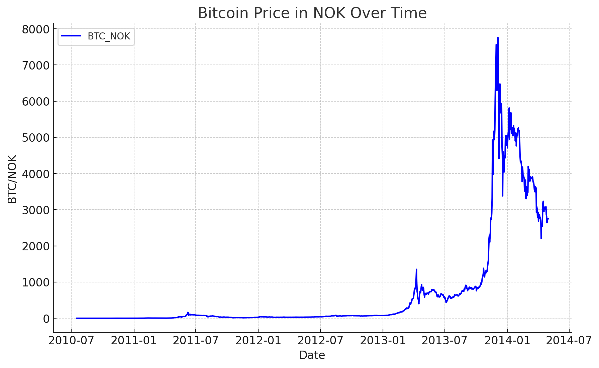

# Reconstructing Bitcoin Norwegian Krone (BTC/NOK) Price History




This project aims to reconstruct the Bitcoin Norwegian Krone (BTC/NOK) price history from 2010 to 2014, as utilized by Norway's pioneering Bitcoin OTC, [Bitmynt](https://bitmynt.no), prior to implementing their own ticker. The reconstruction process involves several key components:

1. Original Method: Bitmynt initially calculated their rates by converting the [MtGox](https://en.wikipedia.org/wiki/Mt._Gox) USD price to NOK. They used the most recent exchange rate from [Norges Bank](https://www.norges-bank.no/en/) and added a 2.5% margin.

2. Exchange Rate Updates: Norges Bank typically published daily exchange rates at about 14:30 CET. This meant the Friday krone exchange rate was used until 14:30 the following Monday. In our reconstruction, due to data limitations, we apply Friday's rate for Saturday and Sunday, and use Monday's rate throughout Monday.

3. Methodology Adaptation: In early 2014, Bitmynt began adjusting their margin to reflect the growing gap between MtGox rates and other exchanges. To account for this, our reconstruction switches to [Bitstamp](https://www.bitstamp.net) data from early 2014 until Bitmynt's own price history begins.

This repository contains the code and data used in this historical price reconstruction effort, as well as the final reconstructed CSV file.

Thanks to Sturle Sunde at Bitmynt for his help in reconstructing the price history.

## Data Sources

To reconstruct the historical price data, we utilized the following sources:

* BTC/USD exchange rates from [MtGox](https://raw.githubusercontent.com/marcosebarreto/Datasets/master/BCHARTS-MTGOXUSD.csv) (covering 2010-2014)
* BTC/USD exchange rates from [Bitstamp](https://www.bitstamp.net/api/v2/ohlc/btcusd/?step=86400&limit=120&end=1398895200) (for 2014)
* USD/NOK exchange rates from [Norges Bank](https://data.norges-bank.no/api/data/EXR/B.USD.NOK.SP?format=csv&startPeriod=2010-07-16&endPeriod=2014-06-01&bom=include) (spanning 2010-2014)

These datasets are stored in the data folder and form the foundation of our reconstructions.

One challenge we encountered was missing MtGox prices for the period 2011-06-20 to 2011-06-25, as shown in this sample:

```csv
Date,Open,High,Low,Close,Volume (BTC),Volume (Currency),Weighted Price
...
2011-06-27,16.45001,18.0,15.0,16.75004,31452.5444794,535096.370101,17.0128165768
2011-06-26,17.51001,17.51001,14.01,16.45001,15053.9269271,234621.797323,15.585421562
2011-06-25,0.0,0.0,0.0,0.0,0.0,0.0,0.0
2011-06-24,0.0,0.0,0.0,0.0,0.0,0.0,0.0
2011-06-23,0.0,0.0,0.0,0.0,0.0,0.0,0.0
2011-06-22,0.0,0.0,0.0,0.0,0.0,0.0,0.0
2011-06-21,0.0,0.0,0.0,0.0,0.0,0.0,0.0
2011-06-20,0.0,0.0,0.0,0.0,0.0,0.0,0.0
2011-06-19,16.85,18.8766,16.85,17.51,30176.739,536267.379238,17.7708856891
2011-06-18,15.9635,16.9499,15.052,16.89,35536.552,569949.344478,16.0383974359
```

To resolve this discrepancy, we interpolate the missing values.

## Output

Running the `btc_nok_reconstruction.py` script will create a CSV file in the root folder called [btc-nok-price-history-reconstruction.csv](btc-nok-price-history-reconstruction.csv) with the reconstructed BTC/NOK price history including Bitmynt's margin adjustments, as well as what the source of the price was for each row.

For convenience, the file is also included in the repository.